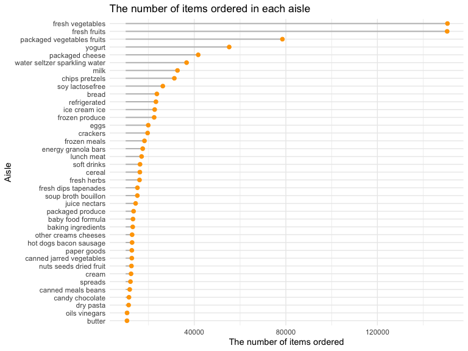
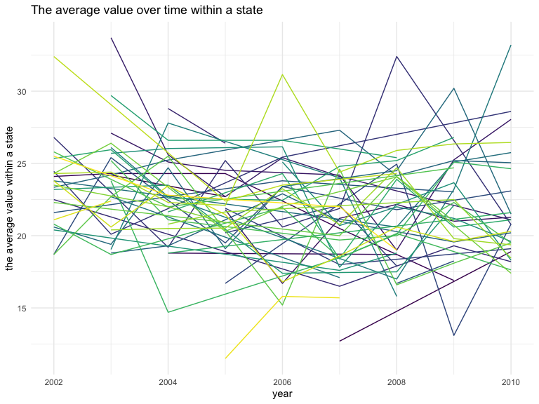
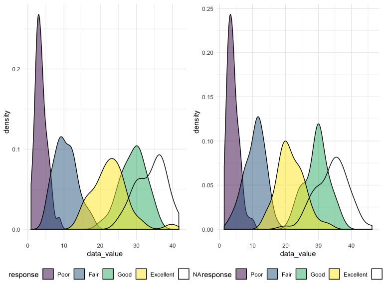
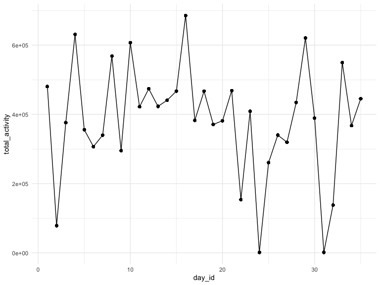
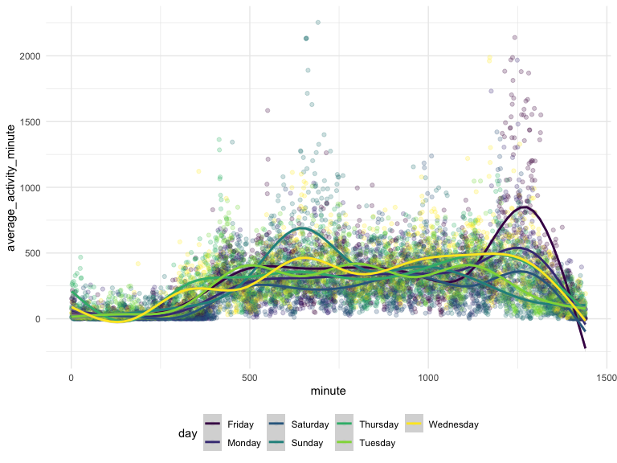

p8105\_hw3\_to2345
================
Tianna Ouyang

``` r
# load instacart data from p8105.datasets
library(p8105.datasets)
data("instacart")
```

  - The dataset instacart has 1384617 rows and 15 columns;
  - The variables in the datasets are: add\_to\_cart\_order, aisle,
    aisle\_id, days\_since\_prior\_order, department, department\_id,
    eval\_set, order\_dow, order\_hour\_of\_day, order\_id,
    order\_number, product\_id, product\_name, reordered, user\_id
  - There are 131209 distinct order\_id in the dataset;
  - There are 131209 distinct user\_id in the dataset;
  - There are 21 distinct department in the dataset, for example, dairy
    eggs, produce, canned goods, beverages, deli;
  - There are 134 distinct aisel in the dataset, for example, yogurt,
    other creams cheeses, fresh vegetables, canned meat seafood, fresh
    fruits.

<!-- end list -->

``` r
# How many aisles are there, and which aisles are the most items ordered from?
instacart %>% 
  group_by(aisle) %>% 
  summarize(
    n = n()
  ) %>% 
  arrange(desc(n))
```

    ## # A tibble: 134 x 2
    ##    aisle                              n
    ##    <chr>                          <int>
    ##  1 fresh vegetables              150609
    ##  2 fresh fruits                  150473
    ##  3 packaged vegetables fruits     78493
    ##  4 yogurt                         55240
    ##  5 packaged cheese                41699
    ##  6 water seltzer sparkling water  36617
    ##  7 milk                           32644
    ##  8 chips pretzels                 31269
    ##  9 soy lactosefree                26240
    ## 10 bread                          23635
    ## # … with 124 more rows

**There are 134 aisles and most items are orderd from “fresh
vegetables”.**

``` r
# Make a plot that shows the number of items ordered in each aisle, limiting this to aisles with more than 10000 items ordered. Arrange aisles sensibly, and organize your plot so others can read it.
instacart %>% 
  group_by(aisle) %>% 
  summarize(
    n = n()
  ) %>% 
  filter(n > 10000) %>% 
  arrange(desc(n)) %>%
  mutate(aisle = forcats::fct_reorder(aisle, n)) %>% 
  ggplot(aes(x = aisle, y = n)) +
  geom_segment(aes(x = aisle, xend = aisle, y = 10000, yend = n), 
               color = "grey", 
               size = 0.7) +
  geom_point( color= "orange",
              size=2 ) +
  coord_flip() +
  theme(
          legend.position="none") +
  xlab("Aisle")+
  ylab("The number of items ordered") +
  ggtitle("The number of items ordered in each aisle")
```



**From the lollipop graph we can see clearly that “fresh vegetables” has
the largest number of items ordered and “butter” has the least number
number of itmes ordered among aisles with more than 10000 items
ordered.**

``` r
# Make a table showing the three most popular items in each of the aisles “baking ingredients”, “dog food care”, and “packaged vegetables fruits”. Include the number of times each item is ordered in your table.
instacart %>% 
  filter(aisle == "baking ingredients"|aisle ==  "dog food care" | aisle == "packaged vegetables fruits") %>% 
  group_by(aisle, product_name) %>% 
  summarize(
    n = n()
  ) %>% 
  group_by(aisle) %>% 
  mutate(
    order_ranking = min_rank(desc(n))
  ) %>% 
  filter(order_ranking <= 3) %>%
  arrange(aisle, order_ranking) %>%
  knitr::kable()
```

| aisle                      | product\_name                                 |    n | order\_ranking |
| :------------------------- | :-------------------------------------------- | ---: | -------------: |
| baking ingredients         | Light Brown Sugar                             |  499 |              1 |
| baking ingredients         | Pure Baking Soda                              |  387 |              2 |
| baking ingredients         | Cane Sugar                                    |  336 |              3 |
| dog food care              | Snack Sticks Chicken & Rice Recipe Dog Treats |   30 |              1 |
| dog food care              | Organix Chicken & Brown Rice Recipe           |   28 |              2 |
| dog food care              | Small Dog Biscuits                            |   26 |              3 |
| packaged vegetables fruits | Organic Baby Spinach                          | 9784 |              1 |
| packaged vegetables fruits | Organic Raspberries                           | 5546 |              2 |
| packaged vegetables fruits | Organic Blueberries                           | 4966 |              3 |

``` r
# Make a table showing the mean hour of the day at which Pink Lady Apples and Coffee Ice Cream are ordered on each day of the week; format this table for human readers (i.e. produce a 2 x 7 table).

instacart %>% 
  filter(product_name == c("Pink Lady Apples","Coffee Ice Cream") ) %>% 
  group_by(product_name, order_dow) %>% 
  summarize(mean_hour = mean(order_hour_of_day)) %>% 
  pivot_wider(
    names_from = order_dow,
    values_from = mean_hour
  ) %>% 
  knitr::kable(digits = 1)
```

| product\_name    |    0 |    1 |    2 |    3 |    4 |    5 |    6 |
| :--------------- | ---: | ---: | ---: | ---: | ---: | ---: | ---: |
| Coffee Ice Cream | 13.2 | 15.0 | 15.3 | 15.4 | 15.2 | 10.3 | 12.4 |
| Pink Lady Apples | 12.2 | 11.7 | 12.0 | 13.9 | 11.9 | 13.9 | 11.6 |

## Problem 2

``` r
# Load the BRFSS data from the p8105.datasets package and data cleaning:
    # format the data to use appropriate variable names;
    # focus on the “Overall Health” topic
    # include only responses from “Excellent” to “Poor”
    # organize responses as a factor taking levels ordered from “Poor” to “Excellent”

data("brfss_smart2010")
brfss = janitor::clean_names(brfss_smart2010) %>% 
  filter(
    topic == "Overall Health",
    response == c("Excellent", "Very good", "Good", "Fair", "Poor")
  ) %>% 
  mutate(
    response = factor(response, levels = c("Poor", "Fair", "Good", "Very Good", "Excellent"))
    )%>% 
  arrange(response) %>% 
  view()
```

``` r
# In 2002, which states were observed at 7 or more locations? What about in 2010?
brfss %>% 
  filter(year == 2002) %>% 
  group_by(locationabbr) %>% 
  summarize(
    n = n()
  ) %>% 
  filter(n >= 7) %>% 
  arrange(n) %>% 
  knitr::kable()
```

| locationabbr |  n |
| :----------- | -: |
| RI           |  8 |
| GA           | 10 |
| ME           | 10 |
| OH           | 10 |
| MA           | 11 |
| NJ           | 15 |
| PA           | 18 |

**In 2002, the states that were observed at 7 or more locations are: RI,
GA, ME, OH, MA, NJ, PA**

``` r
brfss %>% 
  filter(year == 2010) %>% 
  group_by(locationabbr) %>% 
  summarize(
    n = n()
  ) %>% 
  filter(n >= 7) %>% 
  arrange(n) %>% 
  knitr::kable()
```

| locationabbr |  n |
| :----------- | -: |
| NC           |  7 |
| PA           |  7 |
| OH           |  9 |
| SC           |  9 |
| UT           |  9 |
| CO           | 10 |
| ID           | 10 |
| MA           | 10 |
| ME           | 10 |
| TN           | 10 |
| NY           | 15 |
| CA           | 16 |
| MD           | 16 |
| TX           | 18 |
| FL           | 40 |

**In 2010, thestates that were observed at 7 or more locations are: NC,
PA, OH, SC, UT, CO, ID, MA, ME, TN, NY, CA, MD, TX,
FL.**

``` r
# Construct a dataset that is limited to Excellent responses, and contains, year, state, and a variable that averages the data_value across locations within a state. Make a “spaghetti” plot of this average value over time within a state (that is, make a plot showing a line for each state across years – the geom_line geometry and group aesthetic will help).

brfss2 =
  brfss %>% 
  filter(response == "Excellent") %>% 
  group_by(year, locationabbr) %>% 
  mutate(mean_data_value = mean(data_value, na.rm = TRUE)) %>%
  select(year, locationabbr, mean_data_value) %>% 
  distinct() %>% 
  view()

brfss2 %>% 
  ggplot(aes(x = year, y = mean_data_value, group = locationabbr, color = locationabbr)) +
  geom_line() +
  theme(legend.position="none") +
  xlab("year") +
  ylab("the average value within a state") +
  ggtitle("The average value over time within a state")
```



``` r
# Make a two-panel plot showing, for the years 2006, and 2010, distribution of data_value for responses (“Poor” to “Excellent”) among locations in NY State

ny2006 = 
  brfss %>% 
  filter(year == 2006) %>% 
  ggplot(aes(x = data_value, fill = response)) +
  geom_density(alpha = .5) +
  theme(legend.position = "bottom")


ny2010 = 
  brfss %>% 
  filter(year == 2010) %>% 
  ggplot(aes(x = data_value, fill = response)) +
  geom_density(alpha = .5) +
  theme(legend.position = "bottom")

library(patchwork)
(ny2006 + ny2010)
```



## Problem 3

Load, tidy, and otherwise wrangle the data. Your final dataset should
include all originally observed variables and values; have useful
variable names; include a weekday vs weekend variable; and encode data
with reasonable variable classes. Describe the resulting dataset
(e.g. what variables exist, how many observations, etc).

``` r
library(tidyverse)

accel_data = 
  read_csv("../data/accel_data.csv") %>% 
    janitor::clean_names() %>%
    mutate(
      day = factor(day, levels = c("Monday", "Tuesday", "Wednesday","Thursday","Friday","Saturday","Sunday"))
    ) %>% 
    mutate(
      weekend_indicator = case_when(
        day != "Saturday" & day != "Sunday" ~ "0",
        day == "Saturday" | day == "Sunday" ~ "1",
        TRUE ~ ""
      )
    ) 
```

    ## Parsed with column specification:
    ## cols(
    ##   .default = col_double(),
    ##   day = col_character()
    ## )

    ## See spec(...) for full column specifications.

``` r
accel_data_long = 
        accel_data %>% 
        pivot_longer(
        activity_1:activity_1440,
        names_to = "minute",
        names_prefix = "activity_",
        values_to = "activity"
    ) 

summarise_all(accel_data_long, typeof)
```

    ## # A tibble: 1 x 6
    ##   week   day_id day     weekend_indicator minute    activity
    ##   <chr>  <chr>  <chr>   <chr>             <chr>     <chr>   
    ## 1 double double integer character         character double

``` r
accel_data_long = 
  accel_data_long %>% 
  mutate(
    week = as.integer(week),
    day_id = as.integer(day_id),
    day = as.character(day),
    minute = as.integer(minute),
    activity = as.numeric(activity),
    weekend_indicator = as.integer(weekend_indicator)
  )
```

  - The resulting dataset has variables including: activity, day,
    day\_id, minute, week, weekend\_indicator with the variable class of
    integer, integer, character, integer, integer, double respectively.
  - The resulting dataset has 50400 observations in total.

Traditional analyses of accelerometer data focus on the total activity
over the day. Using your tidied dataset, aggregate accross minutes to
create a total activity variable for each day, and create a table
showing these totals. Are any trends apparent?

``` r
accel_data_long %>% 
  group_by(day_id) %>% 
  mutate(total_activity = sum(activity)) %>%
  ggplot(aes(x = day_id, y = total_activity)) +
  geom_point()+
  geom_line()
```



``` r
accel_data_long %>% 
  group_by(day_id) %>% 
  mutate(total_activity = sum(activity)) %>%
  select(week, day_id, day, weekend_indicator, total_activity) %>% 
  distinct() %>% 
  knitr::kable(digits = 1)
```

| week | day\_id | day       | weekend\_indicator | total\_activity |
| ---: | ------: | :-------- | -----------------: | --------------: |
|    1 |       1 | Friday    |                  0 |        480542.6 |
|    1 |       2 | Monday    |                  0 |         78828.1 |
|    1 |       3 | Saturday  |                  1 |        376254.0 |
|    1 |       4 | Sunday    |                  1 |        631105.0 |
|    1 |       5 | Thursday  |                  0 |        355923.6 |
|    1 |       6 | Tuesday   |                  0 |        307094.2 |
|    1 |       7 | Wednesday |                  0 |        340115.0 |
|    2 |       8 | Friday    |                  0 |        568839.0 |
|    2 |       9 | Monday    |                  0 |        295431.0 |
|    2 |      10 | Saturday  |                  1 |        607175.0 |
|    2 |      11 | Sunday    |                  1 |        422018.0 |
|    2 |      12 | Thursday  |                  0 |        474048.0 |
|    2 |      13 | Tuesday   |                  0 |        423245.0 |
|    2 |      14 | Wednesday |                  0 |        440962.0 |
|    3 |      15 | Friday    |                  0 |        467420.0 |
|    3 |      16 | Monday    |                  0 |        685910.0 |
|    3 |      17 | Saturday  |                  1 |        382928.0 |
|    3 |      18 | Sunday    |                  1 |        467052.0 |
|    3 |      19 | Thursday  |                  0 |        371230.0 |
|    3 |      20 | Tuesday   |                  0 |        381507.0 |
|    3 |      21 | Wednesday |                  0 |        468869.0 |
|    4 |      22 | Friday    |                  0 |        154049.0 |
|    4 |      23 | Monday    |                  0 |        409450.0 |
|    4 |      24 | Saturday  |                  1 |          1440.0 |
|    4 |      25 | Sunday    |                  1 |        260617.0 |
|    4 |      26 | Thursday  |                  0 |        340291.0 |
|    4 |      27 | Tuesday   |                  0 |        319568.0 |
|    4 |      28 | Wednesday |                  0 |        434460.0 |
|    5 |      29 | Friday    |                  0 |        620860.0 |
|    5 |      30 | Monday    |                  0 |        389080.0 |
|    5 |      31 | Saturday  |                  1 |          1440.0 |
|    5 |      32 | Sunday    |                  1 |        138421.0 |
|    5 |      33 | Thursday  |                  0 |        549658.0 |
|    5 |      34 | Tuesday   |                  0 |        367824.0 |
|    5 |      35 | Wednesday |                  0 |        445366.0 |

**From the graph and the table showing the change on the total activity
overdays we can barely see apparent trend. One trend that is captured is
that the fluctuation of the total activity is getting larger with the
increase of days. What’s more, there seems like a trend of decreasing
average activity with the increase of days from the graph.**

Accelerometer data allows the inspection activity over the course of the
day. Make a single-panel plot that shows the 24-hour activity time
courses for each day and use color to indicate day of the week. Describe
in words any patterns or conclusions you can make based on this graph

``` r
accel_data_long %>%
  group_by(day, minute) %>% 
  mutate(
    average_activity_minute = mean(activity)
  ) %>% 
  ggplot(aes(x = minute, y = average_activity_minute, color = day)) +
  geom_point(alpha = .05)+
  geom_smooth()+
  theme_minimal() +
  theme(legend.position = "bottom") +
    viridis::scale_fill_viridis(discrete = TRUE)
```

    ## `geom_smooth()` using method = 'gam' and formula 'y ~ s(x, bs = "cs")'



  - Based on the graoh produced, there are several patterns that is
    observed:
  - There are difference in the time of the activity peak accross
    difference days, the most obvious difference detected is the peak of
    activity in Sunday and that in Friday.
  - Commonly, there is a trend of increasing activity until the 1250 min
    of that day, which is followed by a rapid decrease in activity
  - It looks like Saturday has the lowest activity level on average.
